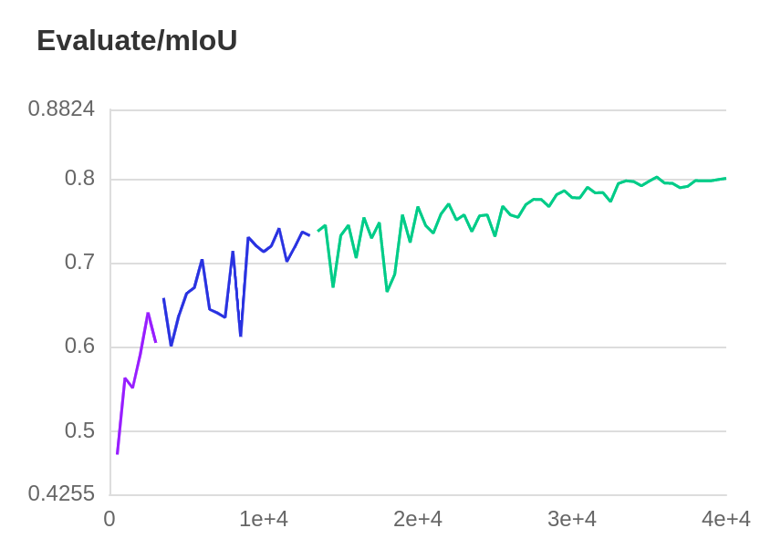

# UPerNet-paddle
paddle version for UPerNet

0. 本复现基于paddle-seg，安装环境时运行pip install -r requirements.txt。
1. 解压模型后将best_model文件夹放置在upernet_cityscapes_b8下，运行run_eval.sh 中即可得到最终结果。该结果为单尺度测试结果，复现精度为80.2，多尺度下结果应该更好。
2. log文件位于upernet_cityscapes_b8文件夹中log下，共有三个，是因为本次训练中途中断了两次，因此共有三个log文件，mIoU训练中测试结果如下：

3. 运行环境为租用的2*V100 32G，一张卡4张图，运行40k，最高精度为80.2。

模型文件和以及log放置位置:

链接: https://pan.baidu.com/s/1SuvJwkZM_2_bfh9K6h68uQ 提取码: xk63
